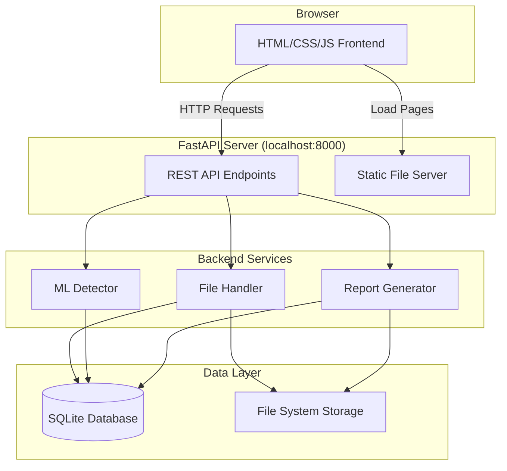

# Design Document: Deepfake Detection Platform

## Overview

This document describes the technical design for a localhost-only deepfake detection platform. The platform allows anyone to upload images or videos and receive detection results indicating whether the media is real or fake, along with a confidence score.

The platform has been simplified from the original requirements:
- **No authentication** - open access, no user accounts or login
- **Localhost only** - runs on a single machine, no production deployment concerns
- **Shared history** - all detection results are visible to anyone using the platform

The core features are:
1. Upload media files (images: JPEG/PNG, videos: MP4/AVI/MOV) up to 500 MB
2. Get detection results with label (real/fake) and confidence score
3. View history of all past detection results
4. Export reports as PDF or JSON

The platform uses a simple three-tier architecture:
- **Frontend**: HTML/CSS/vanilla JavaScript served by FastAPI
- **Backend**: FastAPI REST API with SQLite database
- **ML Layer**: PyTorch/TensorFlow model for deepfake detection

---

## Architecture

### High-Level Architecture



### Component Responsibilities

**Frontend (HTML/CSS/JS)**
- Upload form with file selection and drag-and-drop
- Progress indicators for upload and processing
- Results display page showing label and confidence
- History dashboard with pagination
- Report download buttons

**FastAPI Backend**
- Serve static HTML/CSS/JS files
- Handle file uploads with validation
- Create and track detection jobs
- Coordinate with ML detector
- Generate PDF and JSON reports
- Provide REST API for all operations

**ML Detector**
- Load trained PyTorch/TensorFlow model
- Preprocess uploaded media files
- Run inference and produce predictions
- Return label (real/fake) and confidence score

**SQLite Database**
- Store detection results metadata
- Track job status and timestamps
- Enable history queries with pagination

**File System Storage**
- Store uploaded media files with unique IDs
- Organize files in uploads directory
- Auto-delete files after 30 days

---

## Components and Interfaces

### Frontend Pages

**1. Home / Upload Page** (`/`)
- File upload form (drag-and-drop + file picker)
- Accepted formats: JPEG, PNG, MP4, AVI, MOV
- Max size: 500 MB
- Upload progress bar
- Redirect to results page after upload

**2. Results Page** (`/results/{job_id}`)
- Display detection label (Real / Fake)
- Display confidence score as percentage
- Show original filename and timestamp
- Thumbnail preview (image or video first frame)
- Download buttons for PDF and JSON reports
- Link back to history

**3. History Dashboard** (`/history`)
- Table/grid of all detection results
- Columns: thumbnail, filename, timestamp, label, confidence
- Sorted newest to oldest
- Pagination (20 results per page)
- Click row to view full result details
- Empty state message when no results exist

### API Endpoints

**Upload and Detection**

```
POST /api/upload
Content-Type: multipart/form-data
Body: { file: <binary> }

Response 200:
{
  "job_id": "uuid-string",
  "status": "processing",
  "message": "File uploaded successfully"
}

Response 400:
{
  "error": "Invalid file format. Accepted: JPEG, PNG, MP4, AVI, MOV"
}

Response 413:
{
  "error": "File too large. Maximum size: 500 MB"
}
```

```
GET /api/jobs/{job_id}

Response 200 (processing):
{
  "job_id": "uuid-string",
  "status": "processing",
  "progress": 45
}

Response 200 (complete):
{
  "job_id": "uuid-string",
  "status": "complete",
  "result": {
    "label": "fake",
    "confidence": 0.87,
    "filename": "video.mp4",
    "timestamp": "2025-01-15T10:30:00Z"
  }
}

Response 200 (failed):
{
  "job_id": "uuid-string",
  "status": "failed",
  "error": "Processing error occurred"
}
```

**History**

```
GET /api/history?page=1&limit=20

Response 200:
{
  "results": [
    {
      "job_id": "uuid-1",
      "filename": "image.jpg",
      "timestamp": "2025-01-15T10:30:00Z",
      "label": "real",
      "confidence": 0.92,
      "thumbnail_url": "/api/thumbnails/uuid-1"
    },
    ...
  ],
  "total": 45,
  "page": 1,
  "pages": 3
}
```

**Reports**

```
GET /api/reports/{job_id}/pdf

Response 200:
Content-Type: application/pdf
Body: <PDF binary>
```

```
GET /api/reports/{job_id}/json

Response 200:
Content-Type: application/json
{
  "filename": "video.mp4",
  "timestamp": "2025-01-15T10:30:00Z",
  "label": "fake",
  "confidence": 0.87
}
```

**Thumbnails**

```
GET /api/thumbnails/{job_id}

Response 200:
Content-Type: image/jpeg
Body: <JPEG binary>
```

### Database Schema

**Table: detection_results**

```sql
CREATE TABLE detection_results (
    id TEXT PRIMARY KEY,              -- UUID
    filename TEXT NOT NULL,           -- Original filename
    file_path TEXT NOT NULL,          -- Server storage path
    file_size INTEGER NOT NULL,       -- Bytes
    mime_type TEXT NOT NULL,          -- e.g., "image/jpeg"
    status TEXT NOT NULL,             -- "processing", "complete", "failed"
    label TEXT,                       -- "real" or "fake" (NULL if processing/failed)
    confidence REAL,                  -- 0.0 to 1.0 (NULL if processing/failed)
    error_message TEXT,               -- NULL unless status = "failed"
    created_at TIMESTAMP NOT NULL,    -- Upload time
    completed_at TIMESTAMP,           -- Processing completion time
    thumbnail_path TEXT               -- Path to thumbnail image
);

CREATE INDEX idx_created_at ON detection_results(created_at DESC);
CREATE INDEX idx_status ON detection_results(status);
```

### ML Detector Interface

**Python Class: DeepfakeDetector**

```python
class DeepfakeDetector:
    def __init__(self, model_path: str):
        """Load trained model from disk."""
        pass
    
    def detect(self, file_path: str) -> DetectionResult:
        """
        Process media file and return detection result.
        
        Args:
            file_path: Path to uploaded media file
            
        Returns:
            DetectionResult with label and confidence
            
        Raises:
            ProcessingError: If file cannot be processed
        """
        pass
    
    def generate_thumbnail(self, file_path: str, output_path: str) -> None:
        """
        Generate thumbnail for media file.
        For images: resize to 200x200
        For videos: extract first frame and resize
        """
        pass

@dataclass
class DetectionResult:
    label: str  # "real" or "fake"
    confidence: float  # 0.0 to 1.0
```

### File Storage Structure

```
project_root/
├── uploads/
│   ├── 2025-01/
│   │   ├── uuid-1.mp4
│   │   ├── uuid-2.jpg
│   │   └── ...
│   └── 2025-02/
│       └── ...
├── thumbnails/
│   ├── uuid-1.jpg
│   ├── uuid-2.jpg
│   └── ...
├── models/
│   └── deepfake_detector.pth
└── database/
    └── detections.db
```

Files are organized by upload month for easier cleanup. Thumbnails are stored separately as JPEG files.

---

## Data Models

### Pydantic Models (API Validation)

```python
from pydantic import BaseModel, Field
from datetime import datetime
from typing import Optional, Literal

class UploadResponse(BaseModel):
    job_id: str
    status: Literal["processing"]
    message: str

class DetectionResultModel(BaseModel):
    label: Literal["real", "fake"]
    confidence: float = Field(ge=0.0, le=1.0)
    filename: str
    timestamp: datetime

class JobStatusResponse(BaseModel):
    job_id: str
    status: Literal["processing", "complete", "failed"]
    progress: Optional[int] = None  # 0-100 for processing
    result: Optional[DetectionResultModel] = None
    error: Optional[str] = None

class HistoryItem(BaseModel):
    job_id: str
    filename: str
    timestamp: datetime
    label: Literal["real", "fake"]
    confidence: float
    thumbnail_url: str

class HistoryResponse(BaseModel):
    results: list[HistoryItem]
    total: int
    page: int
    pages: int

class JSONReport(BaseModel):
    filename: str
    timestamp: datetime
    label: Literal["real", "fake"]
    confidence: float
```

### SQLAlchemy Models (Database ORM)

```python
from sqlalchemy import Column, String, Integer, Float, DateTime, Text
from sqlalchemy.ext.declarative import declarative_base
from datetime import datetime

Base = declarative_base()

class DetectionResult(Base):
    __tablename__ = "detection_results"
    
    id = Column(String, primary_key=True)
    filename = Column(String, nullable=False)
    file_path = Column(String, nullable=False)
    file_size = Column(Integer, nullable=False)
    mime_type = Column(String, nullable=False)
    status = Column(String, nullable=False)  # processing, complete, failed
    label = Column(String, nullable=True)  # real, fake
    confidence = Column(Float, nullable=True)
    error_message = Column(Text, nullable=True)
    created_at = Column(DateTime, nullable=False, default=datetime.utcnow)
    completed_at = Column(DateTime, nullable=True)
    thumbnail_path = Column(String, nullable=True)
```

---

## Correctness Properties

*A property is a characteristic or behavior that should hold true across all valid executions of a system—essentially, a formal statement about what the system should do. Properties serve as the bridge between human-readable specifications and machine-verifiable correctness guarantees.*

### Property 1: File Format Validation

*For any* uploaded file, the API should accept it if and only if its MIME type is one of: image/jpeg, image/png, video/mp4, video/avi, or video/quicktime. Files with any other MIME type should be rejected with an error message listing the accepted formats.

**Validates: Requirements 2.1, 2.2, 2.5**

### Property 2: File Size Validation

*For any* uploaded file, the API should accept it if its size is less than or equal to 500 MB, and should reject it with an error message if its size exceeds 500 MB.

**Validates: Requirements 2.3, 2.6**

### Property 3: Job Creation on Valid Upload

*For any* valid media file (correct format and size), uploading it should result in the API creating a detection job and returning a unique job identifier.

**Validates: Requirements 2.8**

### Property 4: Detection Label Validity

*For any* media file processed by the detector, the resulting detection label must be exactly one of two values: "real" or "fake". No other value is permitted.

**Validates: Requirements 3.2**

### Property 5: Confidence Score Range

*For any* detection result produced by the detector, the confidence score must satisfy: 0.0 ≤ confidence ≤ 1.0.

**Validates: Requirements 3.4**

### Property 6: Result Persistence

*For any* completed detection job, querying the database for that job ID should return a detection result with all required fields populated (filename, timestamp, label, confidence).

**Validates: Requirements 3.5**

### Property 7: Error Handling for Failed Jobs

*For any* detection job that fails during processing, the API should store the job status as "failed" and include an error message, and should never return a label or confidence score for that job.

**Validates: Requirements 3.8**

### Property 8: History Completeness

*For any* set of detection results in the database, querying the history endpoint should return all results without omission.

**Validates: Requirements 4.1**

### Property 9: History Ordering

*For any* history response containing two or more results, each result must have a timestamp greater than or equal to the timestamp of the result that follows it (descending order).

**Validates: Requirements 4.2**

### Property 10: History Response Fields

*For any* detection result in a history response, the response object must include all required fields: job_id, filename, timestamp, label, confidence, and thumbnail_url.

**Validates: Requirements 4.3**

### Property 11: Thumbnail Generation

*For any* media file (image or video) that is successfully uploaded, a thumbnail file should be generated and accessible via the thumbnails endpoint.

**Validates: Requirements 4.4, 4.5**

### Property 12: Pagination Limit

*For any* history query, the API should return at most 20 results per page, regardless of how many total results exist in the database.

**Validates: Requirements 4.7**

### Property 13: PDF Report Content

*For any* detection result, generating a PDF report should produce a document that contains the filename, timestamp, label, and confidence score in readable format.

**Validates: Requirements 5.2**

### Property 14: JSON Report Content

*For any* detection result, generating a JSON report should produce a valid JSON document with fields: filename, timestamp, label, and confidence.

**Validates: Requirements 5.3**

### Property 15: JSON Report Round-Trip

*For any* detection result, serializing it to a JSON report and then parsing that JSON back should produce an object with identical field values for filename, timestamp, label, and confidence.

**Validates: Requirements 5.5**

### Property 16: Unique File Identifiers

*For any* two uploaded files (even with identical original filenames), the API should assign different unique identifiers and store them at different file paths.

**Validates: Requirements 6.1**

### Property 17: Confidence Score Formatting

*For any* confidence score value between 0.0 and 1.0, the formatting function should convert it to a percentage string (e.g., 0.87 → "87%").

**Validates: Requirements 8.2**

---

## Error Handling

### Upload Errors

**Invalid File Format**
- Trigger: File with unsupported MIME type
- Response: HTTP 400 with error message listing accepted formats
- Action: Reject upload, do not create job

**File Too Large**
- Trigger: File size > 500 MB
- Response: HTTP 400 with error message stating size limit
- Action: Reject upload, do not create job

**Missing File**
- Trigger: Upload request without file data
- Response: HTTP 400 with error message
- Action: Reject request

### Processing Errors

**Model Inference Failure**
- Trigger: Exception during model prediction
- Response: Job status set to "failed" with error message
- Action: Store failure in database, allow user to retry

**File Corruption**
- Trigger: Uploaded file cannot be read or decoded
- Response: Job status set to "failed" with error message
- Action: Store failure, suggest re-upload

**Thumbnail Generation Failure**
- Trigger: Cannot extract frame or resize image
- Response: Job continues, thumbnail_path set to NULL
- Action: Use default placeholder thumbnail in UI

### Query Errors

**Job Not Found**
- Trigger: Request for non-existent job ID
- Response: HTTP 404 with error message
- Action: Return error to client

**Invalid Pagination Parameters**
- Trigger: page < 1 or limit < 1 or limit > 100
- Response: HTTP 400 with error message
- Action: Reject request with validation error

### Report Generation Errors

**PDF Generation Failure**
- Trigger: ReportLab exception during PDF creation
- Response: HTTP 500 with error message
- Action: Log error, return error to client

**Missing Detection Result**
- Trigger: Report requested for job with status "processing" or "failed"
- Response: HTTP 400 with error message explaining result not available
- Action: Reject request

---

## Testing Strategy

### Dual Testing Approach

The platform will use both unit testing and property-based testing to ensure comprehensive coverage:

**Unit Tests** focus on:
- Specific examples of valid and invalid inputs
- Edge cases (empty files, boundary sizes, special characters in filenames)
- Integration points between components (API → Detector, API → Database)
- Error conditions (network failures, disk full, model loading errors)

**Property-Based Tests** focus on:
- Universal properties that hold for all inputs (see Correctness Properties section)
- Comprehensive input coverage through randomization
- Invariants that must never be violated

Together, unit tests catch concrete bugs in specific scenarios, while property tests verify general correctness across the input space.

### Property-Based Testing Configuration

**Framework**: Hypothesis (Python property-based testing library)

**Configuration**:
- Minimum 100 iterations per property test (due to randomization)
- Each property test must reference its design document property in a comment
- Tag format: `# Feature: deepfake-detection-platform, Property {number}: {property_text}`

**Example Property Test Structure**:

```python
from hypothesis import given, strategies as st
import pytest

# Feature: deepfake-detection-platform, Property 5: Confidence Score Range
@given(media_file=st.binary(min_size=1000, max_size=1000000))
def test_confidence_score_range(media_file):
    """For any detection result, confidence must be in [0.0, 1.0]."""
    result = detector.detect(media_file)
    assert 0.0 <= result.confidence <= 1.0
```

### Unit Testing Strategy

**Test Organization**:
```
tests/
├── unit/
│   ├── test_file_validation.py
│   ├── test_detector.py
│   ├── test_report_generation.py
│   └── test_database.py
├── integration/
│   ├── test_upload_flow.py
│   ├── test_detection_flow.py
│   └── test_history_api.py
└── property/
    ├── test_properties_upload.py
    ├── test_properties_detection.py
    ├── test_properties_history.py
    └── test_properties_reports.py
```

**Coverage Goals**:
- Unit tests: 80% code coverage minimum
- Property tests: All 17 correctness properties implemented
- Integration tests: All API endpoints covered

**Test Data**:
- Sample images: JPEG, PNG (various sizes)
- Sample videos: MP4, AVI, MOV (various lengths)
- Invalid files: TXT, PDF, unsupported formats
- Edge cases: 0-byte files, exactly 500 MB files, 501 MB files

### Testing the ML Detector

**Mock Detector for API Tests**:
- Use a mock detector that returns predictable results
- Allows testing API logic without model dependencies
- Fast execution for CI/CD pipelines

**Real Detector for Integration Tests**:
- Use actual trained model for end-to-end tests
- Verify model loading and inference pipeline
- Test with known deepfake and real samples

**Model Performance Tests** (separate from correctness):
- Accuracy on validation dataset
- Inference time benchmarks
- Memory usage profiling

---

## ML Pipeline Design

### Model Training Pipeline

**Training Data Sources**:
1. DeepFake-TIMIT (low-quality deepfakes)
2. FaceForensics++ (high-quality deepfakes, multiple methods)
3. Google DFD (diverse actors and scenarios)
4. Celeb-DF (celebrity deepfakes)
5. Facebook DFDC (large-scale competition dataset)

**Data Preprocessing**:
1. Face detection and extraction using MTCNN or RetinaFace
2. Face alignment to standard pose
3. Resize to 224×224 pixels
4. Normalize pixel values to [0, 1]
5. Data augmentation: rotation, flip, brightness, contrast

**Model Architecture Options**:

**Option 1: EfficientNet-B4** (Recommended)
- Pre-trained on ImageNet
- Fine-tune on deepfake datasets
- Good balance of accuracy and speed
- ~19M parameters

**Option 2: Xception**
- Proven effective for deepfake detection
- Used in winning DFDC solutions
- ~23M parameters

**Option 3: Vision Transformer (ViT)**
- State-of-the-art performance
- Requires more training data
- Slower inference
- ~86M parameters

**Training Configuration**:
- Framework: PyTorch
- Optimizer: AdamW with learning rate 1e-4
- Loss: Binary cross-entropy
- Batch size: 32
- Epochs: 20-30 with early stopping
- Validation split: 80/20 train/val
- Metrics: Accuracy, AUC-ROC, F1-score

**Model Output**:
- Single sigmoid output: probability of being fake
- Threshold: 0.5 (fake if > 0.5, real if ≤ 0.5)
- Confidence: absolute value of (output - 0.5) * 2

### Inference Pipeline

**For Images**:
1. Load image from file path
2. Detect faces using MTCNN
3. If no face detected: return error
4. If multiple faces: process largest face
5. Extract and align face
6. Resize to 224×224
7. Normalize and convert to tensor
8. Run model inference
9. Apply threshold and calculate confidence
10. Return DetectionResult

**For Videos**:
1. Load video using OpenCV
2. Extract frames at 1 FPS (or every 30th frame)
3. For each frame:
   - Detect and extract face
   - Run inference
4. Aggregate predictions:
   - Average probability across all frames
   - Apply threshold to average
   - Confidence from average probability
5. Return DetectionResult

**Performance Optimizations**:
- Batch processing for video frames
- GPU acceleration if available (CUDA)
- Model quantization for faster inference
- Frame sampling (not every frame) for long videos

### Model Serving

**Model Loading**:
```python
class DeepfakeDetector:
    def __init__(self, model_path: str, device: str = "cpu"):
        self.device = torch.device(device)
        self.model = torch.load(model_path, map_location=self.device)
        self.model.eval()
        self.face_detector = MTCNN(device=self.device)
    
    def detect(self, file_path: str) -> DetectionResult:
        # Implementation as described in inference pipeline
        pass
```

**Model File**:
- Stored in `models/deepfake_detector.pth`
- Loaded once at application startup
- Kept in memory for fast inference

---

## Deployment Instructions (Localhost Setup)

### Prerequisites

- Python 3.10 or higher
- pip (Python package manager)
- Git
- 4 GB RAM minimum (8 GB recommended for video processing)
- 10 GB disk space (for uploads and model)

### Installation Steps

**1. Clone Repository**
```bash
git clone <repository-url>
cd deepfake-detection-platform
```

**2. Create Virtual Environment**
```bash
python -m venv venv
source venv/bin/activate  # On Windows: venv\Scripts\activate
```

**3. Install Dependencies**
```bash
pip install -r requirements.txt
```

**requirements.txt**:
```
fastapi==0.104.1
uvicorn[standard]==0.24.0
python-multipart==0.0.6
sqlalchemy==2.0.23
pydantic==2.5.0
torch==2.1.0
torchvision==0.16.0
opencv-python==4.8.1.78
numpy==1.26.2
pandas==2.1.3
pillow==10.1.0
reportlab==4.0.7
facenet-pytorch==2.5.3
hypothesis==6.92.1
pytest==7.4.3
```

**4. Create Directory Structure**
```bash
mkdir -p uploads thumbnails models database
```

**5. Download or Train Model**

Option A: Download pre-trained model (if available)
```bash
# Download model file to models/deepfake_detector.pth
wget <model-url> -O models/deepfake_detector.pth
```

Option B: Train model from scratch
```bash
# Requires downloading datasets first
python scripts/train_model.py --data-dir ./datasets --output models/deepfake_detector.pth
```

**6. Initialize Database**
```bash
python scripts/init_db.py
```

**7. Run Application**
```bash
uvicorn main:app --host 127.0.0.1 --port 8000 --reload
```

**8. Access Platform**

Open browser and navigate to: `http://127.0.0.1:8000`

### Project Structure

```
deepfake-detection-platform/
├── main.py                 # FastAPI application entry point
├── requirements.txt        # Python dependencies
├── README.md              # Project documentation
├── .gitignore             # Git ignore rules
├── api/
│   ├── __init__.py
│   ├── routes.py          # API endpoint definitions
│   ├── models.py          # Pydantic models
│   └── dependencies.py    # Shared dependencies
├── database/
│   ├── __init__.py
│   ├── models.py          # SQLAlchemy models
│   ├── connection.py      # Database connection
│   └── detections.db      # SQLite database file
├── detector/
│   ├── __init__.py
│   ├── model.py           # DeepfakeDetector class
│   ├── preprocessing.py   # Image/video preprocessing
│   └── inference.py       # Inference logic
├── reports/
│   ├── __init__.py
│   ├── pdf_generator.py   # PDF report generation
│   └── json_generator.py  # JSON report generation
├── static/
│   ├── index.html         # Home/upload page
│   ├── results.html       # Results display page
│   ├── history.html       # History dashboard
│   ├── css/
│   │   └── styles.css     # Main stylesheet
│   └── js/
│       ├── upload.js      # Upload form logic
│       ├── results.js     # Results page logic
│       └── history.js     # History page logic
├── uploads/               # Uploaded media files (gitignored)
├── thumbnails/            # Generated thumbnails (gitignored)
├── models/
│   └── deepfake_detector.pth  # Trained model (gitignored)
├── scripts/
│   ├── init_db.py         # Database initialization
│   ├── train_model.py     # Model training script
│   └── cleanup_old_files.py  # File cleanup cron job
└── tests/
    ├── unit/
    ├── integration/
    └── property/
```

### Configuration

**Environment Variables** (optional, create `.env` file):
```
DATABASE_URL=sqlite:///./database/detections.db
UPLOAD_DIR=./uploads
THUMBNAIL_DIR=./thumbnails
MODEL_PATH=./models/deepfake_detector.pth
MAX_FILE_SIZE=524288000  # 500 MB in bytes
DEVICE=cpu  # or "cuda" if GPU available
```

### Maintenance

**File Cleanup** (run daily via cron):
```bash
python scripts/cleanup_old_files.py --days 30
```

This script deletes uploaded files older than 30 days while preserving detection results in the database.

**Database Backup**:
```bash
cp database/detections.db database/detections_backup_$(date +%Y%m%d).db
```

**Logs**:
- Application logs: stdout (captured by uvicorn)
- Error logs: stderr
- For production-like logging, configure Python logging module

### Troubleshooting

**Port Already in Use**:
```bash
# Use different port
uvicorn main:app --host 127.0.0.1 --port 8001
```

**Model Not Found**:
- Ensure `models/deepfake_detector.pth` exists
- Check MODEL_PATH environment variable

**Out of Memory**:
- Reduce batch size for video processing
- Process fewer frames per video
- Use CPU instead of GPU if GPU memory is limited

**Slow Inference**:
- Enable GPU if available (set DEVICE=cuda)
- Reduce video frame sampling rate
- Use model quantization

---

## Team Roles and Responsibilities

### Frontend Developer

**Responsibilities**:
- Implement HTML/CSS/JS for all three pages (upload, results, history)
- Create responsive layouts (mobile-first design)
- Implement file upload with drag-and-drop
- Display progress indicators and status messages
- Handle API communication via fetch/axios
- Implement pagination controls for history
- Style error messages and empty states

**Key Deliverables**:
- `static/index.html` - Upload page
- `static/results.html` - Results display page
- `static/history.html` - History dashboard
- `static/css/styles.css` - Main stylesheet
- `static/js/*.js` - Client-side logic

**Dependencies**:
- Backend API endpoints (from Backend Developer)
- API response formats (from Backend Developer)

### Backend Developer

**Responsibilities**:
- Implement FastAPI routes and endpoints
- Handle file uploads with validation (format, size, MIME type)
- Implement database models and queries (SQLAlchemy)
- Create Pydantic models for request/response validation
- Coordinate with ML Detector for inference
- Implement pagination logic for history
- Generate and serve thumbnails
- Serve static files (HTML/CSS/JS)

**Key Deliverables**:
- `main.py` - FastAPI application
- `api/routes.py` - API endpoints
- `api/models.py` - Pydantic models
- `database/models.py` - SQLAlchemy models
- `reports/pdf_generator.py` - PDF generation
- `reports/json_generator.py` - JSON generation

**Dependencies**:
- ML Detector interface (from ML Engineer)
- Frontend requirements (from Frontend Developer)

### ML Engineer

**Responsibilities**:
- Train deepfake detection model on specified datasets
- Implement preprocessing pipeline (face detection, alignment, normalization)
- Create DeepfakeDetector class with inference logic
- Handle both image and video processing
- Generate thumbnails from media files
- Optimize inference performance (batching, GPU acceleration)
- Provide model evaluation metrics

**Key Deliverables**:
- `detector/model.py` - DeepfakeDetector class
- `detector/preprocessing.py` - Preprocessing functions
- `detector/inference.py` - Inference logic
- `models/deepfake_detector.pth` - Trained model file
- `scripts/train_model.py` - Training script
- Model performance report (accuracy, speed)

**Dependencies**:
- Dataset access (download links or local copies)
- Backend API interface requirements (from Backend Developer)

### QA / Integration Engineer

**Responsibilities**:
- Write unit tests for all components
- Implement property-based tests using Hypothesis
- Create integration tests for API endpoints
- Test end-to-end workflows (upload → detect → view → export)
- Set up pytest configuration and test fixtures
- Verify all 17 correctness properties
- Test error handling and edge cases
- Document test coverage

**Key Deliverables**:
- `tests/unit/*.py` - Unit tests
- `tests/property/*.py` - Property-based tests
- `tests/integration/*.py` - Integration tests
- `pytest.ini` - Pytest configuration
- Test coverage report
- Bug reports and regression tests

**Dependencies**:
- All components from other team members
- Access to sample test data (images, videos)

### Collaboration Points

**Week 1-2**: Setup and Architecture
- All: Review requirements and design document
- Backend + ML: Define Detector interface contract
- Backend + Frontend: Define API contracts (endpoints, request/response formats)
- QA: Set up test infrastructure

**Week 3-4**: Core Implementation
- Frontend: Build upload page and basic UI
- Backend: Implement upload endpoint and database
- ML: Train initial model and implement inference
- QA: Write unit tests for completed components

**Week 5-6**: Integration
- Frontend: Connect UI to API endpoints
- Backend: Integrate with ML Detector
- ML: Optimize inference performance
- QA: Run integration tests, identify bugs

**Week 7-8**: Polish and Testing
- Frontend: Implement history and results pages
- Backend: Implement report generation
- ML: Fine-tune model, generate thumbnails
- QA: Complete property-based tests, full coverage

**Week 9-10**: Final Testing and Documentation
- All: Bug fixes and refinements
- QA: Final test pass, regression testing
- All: Update documentation and README

---

## Summary

This design document provides a comprehensive blueprint for building a localhost-only deepfake detection platform with no authentication. The architecture is simple and clean:

- **Frontend**: Vanilla HTML/CSS/JS served by FastAPI
- **Backend**: FastAPI with SQLite database
- **ML**: PyTorch/TensorFlow detector with face extraction
- **Storage**: Local filesystem for uploads and thumbnails

The platform supports image and video uploads up to 500 MB, provides detection results with confidence scores, maintains a shared history of all detections, and allows report export as PDF or JSON.

All 17 correctness properties have been identified and will be validated through property-based testing using Hypothesis. The testing strategy combines unit tests for specific cases with property tests for universal invariants.

The team of 4 (Frontend, Backend, ML, QA) has clear responsibilities and deliverables, with defined collaboration points throughout the 10-week development timeline.
